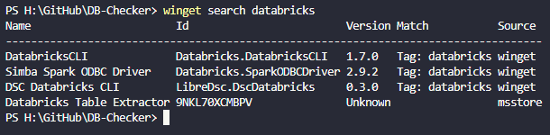
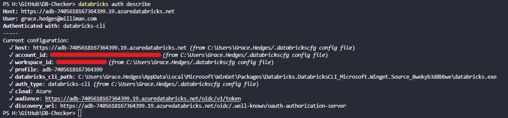

# Databricks CLI Configuration
1. open Windows PowerShell
1. run `winget search databricks` 
1. accept the Microsoft TOS if prompted
1. run `winget install Databricks.DatabricksCLI`
1. exit Windows PowerShell
1. open Windows PowerShell
1. run `databricks auth login --host https://adb-7405618167364399.19.azuredatabricks.net/`
   - This is for the [ws-databricks-indy-indianapolis-centralus-213 workspace](https://adb-7405618167364399.19.azuredatabricks.net/); for other workspaces, use their host url.
1. name the Databricks profile or press [ENTER] to skip 
1. authenticate your Databricks account in the browser
* Additional resources (instructions for Azure are the same):
  * [Install or Update the Databricks CLI | Databricks on AWS](https://docs.databricks.com/aws/en/dev-tools/cli/install)
  * [Authentication for the Databricks CLI | Databricks on AWS](https://docs.databricks.com/aws/en/dev-tools/cli/authentication)
  * [Databricks REST API reference](https://docs.databricks.com/api/workspace/introduction)

You can verify that you have set up the profile correctly by running `databricks auth describe`. It should look similar to this:
 