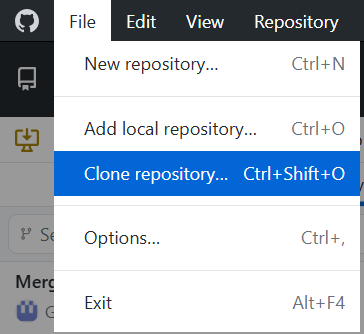
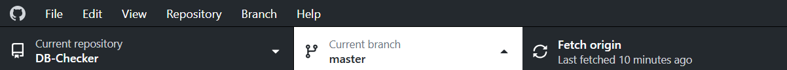
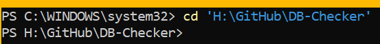
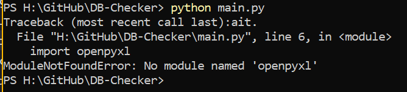
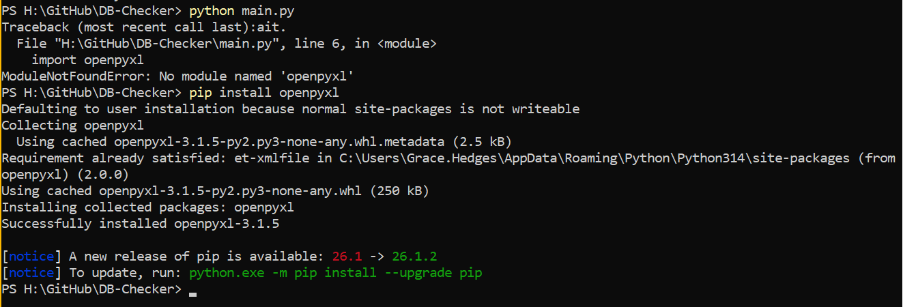

# Running in Python
Running in Python will be much faster. To do this, you'll need to either download the source code from the [latest release](https://github.com/GraceHe00/DB-Checker/releases/latest) or [clone the repo](#clone-the-repo). If you've already done this, you can skip to [installing and running Python](#installing-and-running-python).

## Clone the Repo
1. In the Software Center, install GitHub Desktop.
1. Open GitHub Desktop and complete the set up instructions.
1. Click File > Clone repository... or press `Ctrl` + `Shift` + `O`. .
1. Click URL and input this link: [https://github.com/GraceHe00/DB-Checker/](https://github.com/GraceHe00/DB-Checker/). Select whichever local path you prefer. In this example, I use my H:\ drive.
1. Press Clone.
1. From the top, you'll want to ensure that you're on the master branch.
    - You may also checkout or select other branches, but it is not guaranteed that they are fully operable at any given time.
1. Click 'Fetch origin' to ensure that you are up-to-date with the version online. 
1. After fetching, 'Pull origin' if you are prompted. 

## Installing and Running Python
1. In the Software Center, install Python if it's not installed already.
1. Open Windows Powershell.
1. Change directories so that you are in the path location of the source code. For example, since my repo is cloned into my H: drive, I'd put `cd 'H:\GitHub\DB-Checker'`. 
    - `cd` stands for 'change directory'.
    - Ensure that you are in the right directory by running `dir`. You should see all of the files and folders from the DB Checker repository.
1. The first time you run, you should ensure that you have all of the necessary dependencies installed. The easiest way to do this is by running [pip_install.bat](../../pip_install.bat).
    - If this does not work, or if you'd prefer to do this manually, please follow the directions [below](#installing-the-dependencies).
1. You can run the program by now running `python main.py`.
1. To exit the program early, you may either exit out of Windows Powershell, or you can introduce a KeyboardInterrupt by pressing `Ctrl` + `C`.

### Installing the Dependencies
 In the image above, I am missing the openpyxl module, so I will run `pip install openpyxl` to install this dependency.  Once you've installed the dependency, you will not need to install it on subsequent runs. You may need to repeat this step multiple times in order to install all of the dependencies. Some of them will already be available on your computer from when you installed Python. A full list of all dependencies used is below:
- `openpyxl`: used for creating Excel documents
- `os`: OS routines for NT or Posix depending on what system we're on
- `datetime`: specific date/time and related types
- `typing`: support for gradual typing as defined by PEP 484 and subsequent PEPs
- `pathlib`: object-oriented filesystem paths
    - This module provides classes to represent abstract paths and concrete paths with operations that have semantics appropriate for different operating systems.
- `subprocess`: subprocesses with accessible I/O streams
    - This is used to interact with the Databricks CLI.
    - This module allows you to spawn processes, connect to their input/output/error pipes, and obtain their return codes.
- `re`: support for regular expressions (RE)
    - This module provides regular expression matching operations similar to those found in Perl. It supports both 8-bit and Unicode strings; both the pattern and the strings being processed can contain null bytes and characters outside the US ASCII range.
- `glob`: filename globbing utility
    - 'Globbing' is using wildcard patterns to match filenames, allowing for flexible selection of files or directories within a filesystem.
- `zipfile`: read and write ZIP files
- `configparser`: configuration file parser
    - A configuration file consists of sections, lead by a "[section]" header, and followed by "name: value" entries, with continuations and such in the style of RFC 822.
- `sys`: built-in functions, types, exceptions, and other objects
    - This module provides direct access to all 'built-in' identifiers of Python; for example, builtins.len is the full name for the built-in function len().
- `halo`: loading spinner
- `requests`: requests HTTP library
    - This is used to check the program's version against the latest release in GitHub.
- `pyxdameraulevenshtein`: used to calculate the Damerau-Levenshtein distance between two sequences
    - Copyright (c) 2013, Triad National Security, LLC All rights reserved. Redistribution and use in source and binary forms, with or without modification, are permitted provided that the following conditions are met:
        - Redistributions of source code must retain the above copyright notice, this list of conditions and the following disclaimer.
        - Redistributions in binary form must reproduce the above copyright notice, this list of conditions and the following disclaimer in the documentation and/or other materials provided with the distribution.
        - Neither the name of Triad National Security, LLC nor the names of its contributors may be used to endorse or promote products derived from this software without specific prior written permission.
